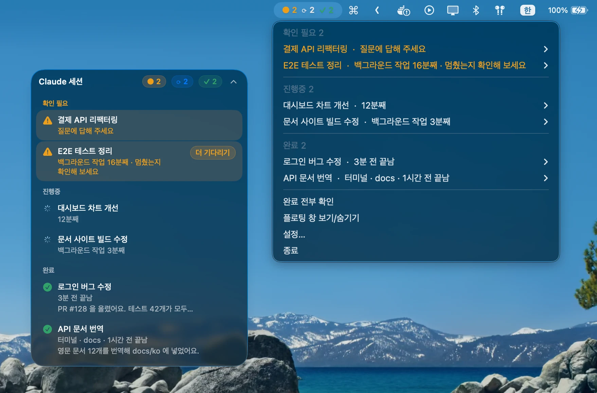
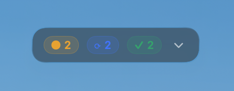
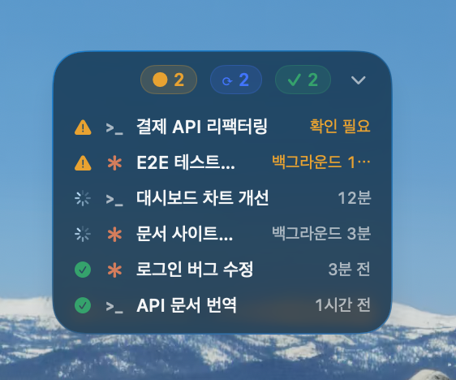
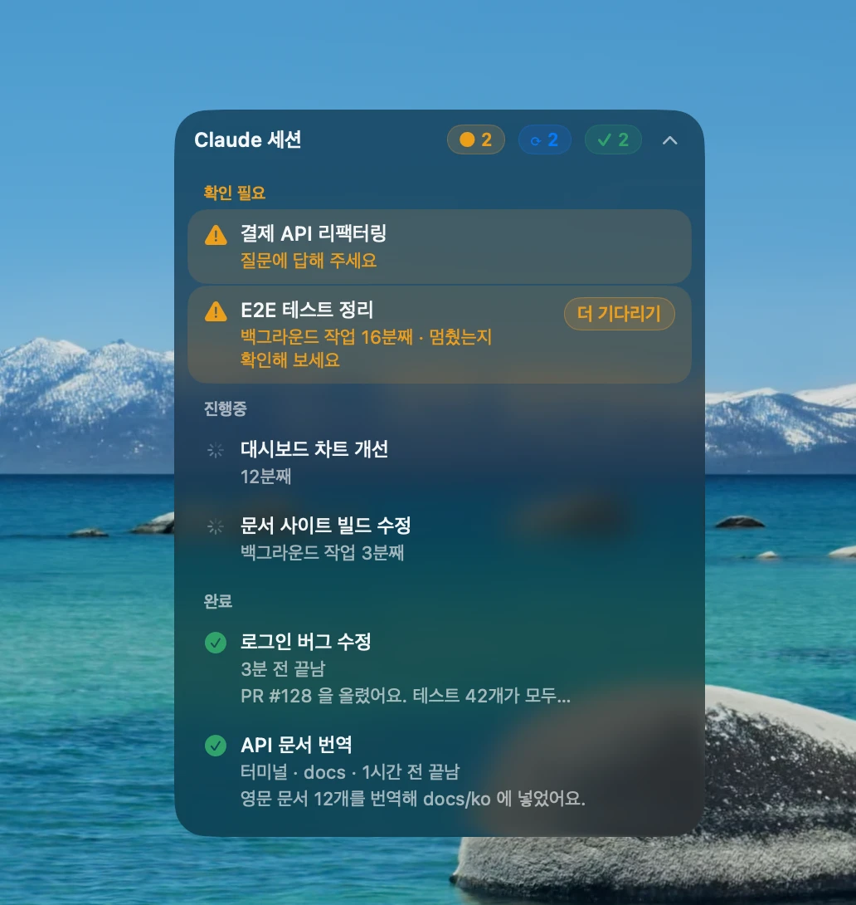
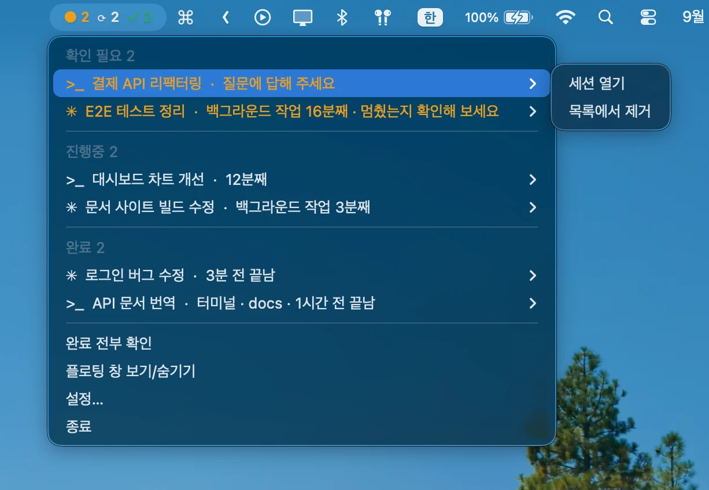

# SessionBoard

[English](README.en.md)

Claude Code 나 Codex 세션을 여러 개 동시에 돌리다 보면, 어떤 세션이 아직 작업 중이고 어떤 세션이 끝났는지, 또 어떤 세션이 내 답을 기다리고 있는지 놓치기 쉬워요.
SessionBoard 는 화면 구석에 떠 있는 작은 창과 메뉴 막대에서 모든 세션의 상태를 한눈에 보여 줘요.

- **진행중**: Claude·Codex 가 작업하고 있어요. 얼마나 됐는지, 백그라운드 작업이 도는지도 보여 줘요.
- **확인 필요**: 내가 답할 차례예요. 권한 승인, 선택지 질문, 계획 승인, 너무 오래 도는 백그라운드 작업이 여기에 올라와요.
- **완료**: 작업이 끝났어요. 마지막 답의 첫 줄을 보여 주고, **확인을 누르기 전까지** 목록에 남아 있어요.

Claude 데스크톱 앱(Code 탭)에서 연 세션, 터미널에서 실행한 `claude` 세션, 그리고 Codex(앱·CLI) 세션을 모두 보여 줘요. 세션 제목 앞 기호로 도구를 구분해요. **Claude 는 주황 ✳, Codex 는 `>_`** 예요.

<p align="center"></p>

## 설치

macOS 15 이상에서 쓸 수 있어요 (Apple Silicon·Intel). Liquid Glass UI 는 macOS 26 이상에서 보여요.

### Homebrew

```bash
brew install --cask jongjunpark/tap/session-board
```

### 직접 내려받기

[최신 릴리스](https://github.com/jongjunpark/session-board/releases/latest)에서 `SessionBoard.zip` 을 내려받아 압축을 풀고, `SessionBoard.app` 을 응용 프로그램 폴더로 옮기세요.

Apple 공증을 받지 않은 앱이라 처음 열 때 "확인되지 않은 개발자" 경고가 떠요. 아래 방법 중 하나로 한 번만 열어 주면 그다음부터는 바로 열려요.

- **Finder**: `SessionBoard.app` 을 오른쪽 클릭 → **열기** → 대화상자에서 한 번 더 **열기**
- **터미널**: `xattr -dr com.apple.quarantine /Applications/SessionBoard.app`

Homebrew 로 설치하면 이 과정이 필요 없어요.

### 처음 실행할 때

앱을 처음 열면 Claude Code 설정 파일(`~/.claude/settings.json`)에 훅을 추가할지 물어봐요. Codex 를 쓰는 맥이면 Codex 설정(`~/.codex/hooks.json`)에도 같이 추가해요.

- 이미 설정해 둔 내용과 다른 훅은 그대로 두고, 필요한 훅만 추가해요.
- 수정하기 전의 원본은 `settings.json.bak-session-board-<시각>` 으로 백업해 둬요.
- 로그인할 때 자동으로 켜지도록 등록해요.
- 이미 실행 중인 세션은 **다음 요청부터** 목록에 나타나요.
- **Codex 는 새 훅을 직접 허용해야 실행해요.** Codex 앱은 입력창의 갈고리 아이콘(노란 점), CLI 는 "Trust all and continue" 로 허용해 주세요. 자세한 내용은 [Claude Code·Codex 훅과 권한](#claude-codecodex-훅과-권한)을 보세요.

## 사용법

평소에는 세션 개수만 보이도록 작게 접혀 있어요.

| 접힌 상태 | 마우스를 올리면 | 클릭하면 |
|:---:|:---:|:---:|
|  |  |  |

| 이렇게 하면 | 이렇게 돼요 |
|---|---|
| 접힌 창에 마우스를 올려 두기 | 세션 목록이 한 줄씩 간단히 펼쳐져요 |
| 접힌 창을 클릭하기 | 요약과 버튼까지 보이는 큰 창으로 열려요 |
| 세션을 클릭하기 | Claude·Codex 앱에서 그 세션이 열려요 (터미널에서 실행한 세션은 그 터미널 앱이 앞으로 와요) |
| 완료된 세션의 **확인** 누르기 | 목록에서 사라져요 (마우스를 올리면 버튼이 보여요) |
| **더 기다리기** 누르기 | 오래 도는 백그라운드 작업 알림을 설정한 시간만큼 미뤄요 |
| 창 윗부분을 오른쪽 클릭하기 | 완료 전부 확인, 새로고침, 설정, 종료 |
| 창을 드래그하기 | 원하는 곳으로 옮길 수 있어요. 위치는 기억해 둬요 |

### 메뉴 막대

<p align="center"></p>

메뉴 막대에도 `● 확인 필요  ⟳ 진행중  ✓ 완료` 개수가 표시돼요. 누르면 세션 목록이 열리고, 세션마다 열기·확인·더 기다리기를 할 수 있어요. 떠 있는 창을 숨기고 메뉴 막대만 쓸 수도 있어요 (메뉴 막대 → **플로팅 창 보기/숨기기**).

확인이 필요한 세션이 생기면 소리와 함께 알림이 와요.

## 설정

창 윗부분을 오른쪽 클릭 → **설정…** 에서 바꿀 수 있어요.

- **일반**: 로그인 시 자동 실행, 메뉴 막대에 표시
- **백그라운드 작업**: 장시간 실행 알림 켜기/끄기, 알림 시간(5분·10분·15분·20분·30분·1시간, 기본 15분). Claude Code 의 백그라운드 작업과, Codex 에서 답이 끝난 뒤에도 도는 명령에 적용돼요
- **업데이트**: 업데이트 알림 켜기/끄기, 지금 확인
- **관리**: Claude Code·Codex 연동(연결·연결 해제), SessionBoard 삭제

## 업데이트

업데이트 알림을 켜 두면 앱이 켜질 때와 6시간마다 새 버전이 있는지 확인해요. 새 버전이 있으면 창 윗부분에 **새 버전** 표시가 뜨고, 누르면 바로 업데이트할 수 있어요.

- 직접 내려받아 설치했다면 새 버전을 내려받아 파일이 맞는지 확인한 뒤 바꿔 끼우고 다시 켜요.
- Homebrew 로 설치했다면 `brew upgrade` 로 업데이트하고 다시 켜요.

터미널에서 `/Applications/SessionBoard.app/Contents/MacOS/SessionBoard --self-update` 를 실행해도 새 버전이 있으면 바로 업데이트해요.

## Claude Code·Codex 훅과 권한

SessionBoard 는 세션 상태를 알기 위해 Claude Code 와 Codex 에 **훅**을 추가해요. 훅은 세션에 일이 생길 때(요청을 보냄, 도구를 씀, 승인을 기다림, 끝남 등) 도구가 대신 실행해 주는 작은 명령이에요.

### 추가하는 훅

| 도구 | 설정 파일 | 실행하는 명령 |
|---|---|---|
| Claude Code | `~/.claude/settings.json` | `~/.claude/session-board/bin/hook.sh` |
| Codex | `~/.codex/hooks.json` | `~/.claude/session-board/bin/hook.sh --agent codex` |

- 이미 있는 다른 설정과 훅은 그대로 두고, 필요한 훅만 더해요. 고치기 전 원본은 같은 폴더에 `.bak-session-board-<시각>` 으로 백업해요.
- 훅은 세션 상태를 `~/.claude/session-board/state/` 에 파일로 남기고, 확인이 필요할 때 알림을 띄우는 일만 해요. 세션 내용을 바꾸거나 승인을 대신 누르지 않고, 외부로 아무것도 보내지 않아요.

### 허용 방식의 차이

**Claude Code** 는 설정 파일에 훅을 넣으면 바로 동작해요. 따로 허용할 필요가 없어요. (이미 돌고 있던 세션은 다음 요청부터 잡혀요)

**Codex** 는 보안을 위해 **새로 생기거나 바뀐 훅을 사용자가 직접 허용해야** 실행해요. 허용하지 않은 훅은 조용히 건너뛰어서, 허용 전에는 Codex 세션이 목록에 나타나지 않아요.

- 화면으로 보는 방법은 [Codex 훅 허용하기](docs/codex-hooks.md)에 정리했어요.
- **Codex 앱**: 입력창 오른쪽의 **갈고리 아이콘(노란 점이 붙어 있어요)** 을 눌러 SessionBoard 훅을 허용해요.
- **Codex CLI**: 시작할 때 뜨는 "Review hooks" 창에서 **Trust all and continue** 를 고르거나, `/hooks` 로 검토해 허용해요.
- **한 번만 허용하면 앱과 CLI 모두에 적용돼요.** 허용 기록은 `~/.codex/config.toml` 의 `[hooks.state]` 에 저장돼요.
- **SessionBoard 를 업데이트해도 다시 허용할 필요는 없어요.** Codex 는 `hooks.json` 에 적힌 훅 정의를 기준으로 허용 여부를 기억하고, SessionBoard 는 업데이트 때 그 정의를 바꾸지 않아요. (훅 스크립트 내용이 바뀌는 건 영향이 없어요)
- SessionBoard 가 허용 기록을 대신 써 넣지는 않아요. Codex 의 보안 확인을 우회하는 일이라, 허용은 늘 사용자가 직접 해요.

### 확인하고 끄기

- 연결 상태는 **설정… → 관리 → Claude Code 연동 / Codex 연동** 에서 보고, 연결·연결 해제할 수 있어요.
- 연결 해제하면 해당 설정 파일에서 SessionBoard 훅만 빠져요. Codex 의 허용 기록(`[hooks.state]`)은 Codex 가 관리하는 것이라 남아 있을 수 있어요.

## 동작 방식

1. 세션에 변화가 생길 때마다 Claude Code·Codex 훅이 `~/.claude/session-board/bin/hook.sh` 를 실행해서, 세션별 상태 파일(`~/.claude/session-board/state/*.json`)을 기록해요.
2. 앱은 3초마다 이 파일들을 읽어 화면에 보여 줘요. 세션 제목은 Claude 데스크톱 앱의 세션 정보에서 가져오고, 터미널 세션은 대화 기록에 저장된 제목(`/rename` 으로 붙인 이름이나 자동 제목)을, Codex 세션은 Codex 가 저장한 스레드 제목을 써요.
3. Claude Code 의 백그라운드 작업은 시작할 때 기록해 두고 대화 기록에 완료 알림이 들어오면 빼요. Codex 는 명령이 시작될 때 기록해 두고 끝나면 빼는데, 답(턴)이 끝난 뒤에도 남아 도는 명령만 백그라운드 작업으로 보여 줘요.

업데이트를 확인할 때 GitHub 에 접속하는 것 말고는 외부로 나가는 데이터가 없어요. 모든 기록은 이 맥 안에만 저장돼요.

## 알아 두면 좋은 점

- 세션 제목을 가져오거나 앱 세션인지 구분할 때, Claude 데스크톱 앱과 Codex 가 내부적으로 저장하는 파일을 읽어요. 공개된 형식이 아니어서 **앱이 업데이트되면 제대로 동작하지 않을 수 있어요.**
- `claude -p`, `codex exec` 처럼 뒤에서 도는 실행은 목록에 나타나지 않아요.
- Claude 세션은 작업 도중에 멈춤을 누르면 끝났다는 신호가 오지 않아서 진행중으로 남아 있어요. (Codex 는 "중단됨"으로 바로 표시돼요) 10분 넘게 움직임이 없으면 "소식 없음"이 표시돼요.
- Claude 가 선택지 창 없이 글로만 되묻고 끝나면, 확인 필요가 아니라 완료로 표시돼요.
- 터미널 세션을 클릭하면 터미널 앱만 앞으로 가져오고, 여러 탭 중 해당 탭으로 이동하지는 못해요.

- Codex 는 훅으로 알려 주는 신호가 Claude Code 보다 적어서, 아래 경우는 **확인 필요로 잡히지 않아요.**
  - 계획을 보여 주고 승인을 기다릴 때 (턴이 끝나 완료로 보여요)
  - 연결된 도구(MCP)가 입력이나 로그인을 요청할 때
  - 자동화(예약 실행)로 돈 세션을 따로 구분하지 못해 목록에 함께 보여요
  - `명령 &` 처럼 완전히 떼어 낸 프로세스는 끝났는지 알 수 없어요

## 제거

- **앱에서**: 창 윗부분을 오른쪽 클릭 → **설정…** → **SessionBoard 삭제**. Claude Code·Codex 연결, 자동 실행 등록, 기록을 모두 지워요. 그다음 앱을 휴지통에 버리면 돼요.
- **Homebrew**: `brew uninstall --zap --cask session-board`

## 직접 빌드하기

```bash
swift build                       # 디버그 빌드
./scripts/build-app.sh            # build/SessionBoard.app 만들기
./scripts/build-app.sh --install  # /Applications 에 설치하고 실행
```

## 라이선스

[MIT](LICENSE)
