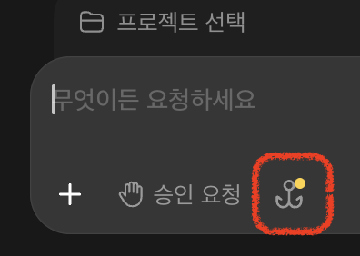
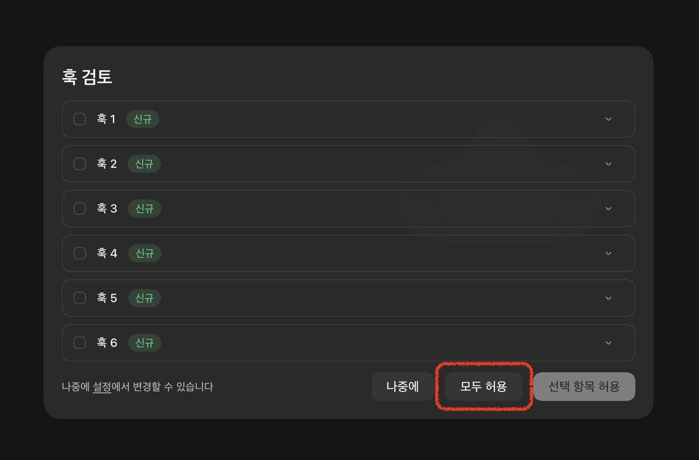
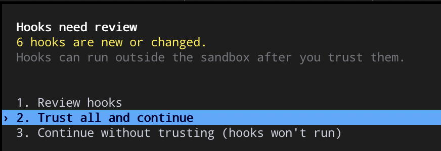

# Codex 훅 허용하기

[English](codex-hooks.en.md) · [README 로 돌아가기](../README.md#claude-codecodex-훅과-권한)

SessionBoard 는 Codex 세션 상태를 알기 위해 Codex 설정(`~/.codex/hooks.json`)에 훅 **6개**를 추가해요.
Codex 는 보안을 위해 **새로 생기거나 바뀐 훅을 사용자가 직접 허용해야** 실행해요. 허용하기 전에는 Codex 세션이 SessionBoard 목록에 나타나지 않아요.

한 번만 허용하면 **Codex 앱과 CLI 모두**에 적용돼요. 둘 중 편한 곳에서 한 번만 하면 돼요.

## Codex 앱에서 허용하기

**1.** 입력창 아래의 **갈고리 아이콘**을 눌러요. 허용할 훅이 있으면 노란 점이 붙어 있어요.

**2.** "훅 검토" 창에 SessionBoard 훅 6개가 **신규**로 떠요. **모두 허용**을 눌러요.

## Codex CLI 에서 허용하기

`codex` 를 실행하면 "Hooks need review" 창이 떠요. **2. Trust all and continue** 를 골라요.

`3. Continue without trusting` 을 고르면 훅이 실행되지 않아 Codex 세션이 목록에 나타나지 않아요. 나중에 `/hooks` 로 다시 검토할 수 있어요.

## 알아 두면 좋은 점

- **SessionBoard 를 업데이트해도 대부분 다시 허용할 필요가 없어요.** Codex 는 `hooks.json` 에 적힌 훅 정의(명령·이벤트·대상)를 기준으로 허용 여부를 기억해요. SessionBoard 가 훅 정의를 바꾸는 업데이트일 때만 다시 허용해야 하고, 그때는 앱이 먼저 알려 드려요.
- 허용 기록은 `~/.codex/config.toml` 의 `[hooks.state]` 에 저장돼요. SessionBoard 가 이 기록을 대신 써 넣지는 않아요. Codex 의 보안 확인을 우회하는 일이라, 허용은 늘 직접 해요.
- 훅은 세션 상태를 `~/.claude/session-board/state/` 에 파일로 남기고(받은 신호 종류는 문제 확인용으로 `events.log` 에 최근 500줄만), 확인이 필요할 때 알림을 띄우는 일만 해요. 세션 내용을 바꾸거나 승인을 대신 누르지 않고, 외부로 아무것도 보내지 않아요.
- 연결 상태는 SessionBoard 의 **설정… → 관리 → Codex 연동** 에서 보고, 연결·연결 해제할 수 있어요.
